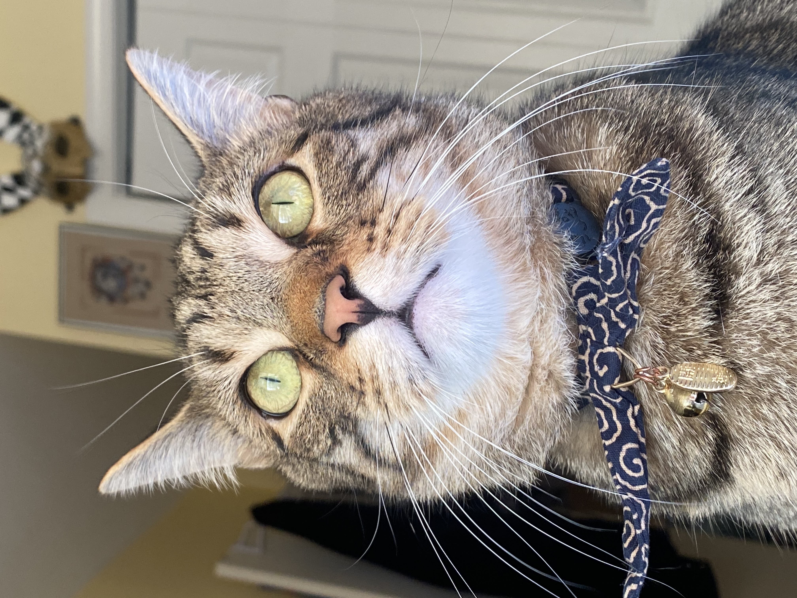

class: middle, center

# Review!

---
# Review from lecture 

## Different levels of meaning in language 

**Literal meaning**

- <u>semantics</u> studies literal meaning in language 

**Implied meaning**

- <u>pragmatics</u> studies implied meaning in language 

**Social meaning**

- <u>sociolinguistics</u> and <u>linguistic anthropology</u> study social meaning 


---

# Review from lecture 

### Discuss in small-ish groups.

- lexical semantics vs. compositional semantics

- sense vs. reference

--

- possible worlds

- truth values

--

- synonym vs. antonym

- hypernym vs. hyponym


---

class: middle, center

# Semantic relations (review still)

---

# Semantic relations 

- **synonym:** words that have the same reference / refer to the same set of things in the world 

  - *drinks* and *beverages*

- **hypernym:** words whose reference is a _superset_ of another words reference

- **hyponym:** words whose reference is a _subset_ of another words reference

  - *gecko* (hyponym) vs. *lizard* (hypernym)
  
- **antonym:** words that have opposite meanings

  - *subtypes on next slide....*

---

# Semantic relations

**antonym:** words that have opposite meanings

--

- <u>Complementary pairs:</u> items that can't be in both categories 

  - *alive* vs. *dead*
  
- <u>Gradable pairs:</u> opposite ends of a scale 

  - *young* vs. *old*
  
- <u>Reverses:</u> opposite directions 

  - *up* vs. *down*
  
- <u>Converses:</u> same action, different perspective 

  - *buy* vs. *sell*

---

# Semantic relations 

Are the following word pairs *synonyms, antonyms,* or a *hypernym-hyponym* pair?

1. bird - avian 

2. bird - sparrow 

3. bird - animal

4. rodent - rat

5. good - evil

6. to clean - to mess up/dirty

--

7. ***more??***

---

class: middle, center

# ENTAILMENT

## sentence **p** entails sentence **q** if and only if **q** is *true* whenever **p** is *true*

### "whenever" there is a possible world where the sentence **p** is *true*, while **q** is *false*

---

class: middle, center

# ENTAILMENT: example

--

### <u>Quartz is a linguistics student</u>

# entails  

### <u>Quartz is a student</u>. 

--

### if Quartz is **NOT** a <u>student</u>, then it's impossible for Quartz to be a <u>linguistics student</u>

---

class: middle, center

# Practice: entailment 

---

# Practice: entailment 

For each pair of sentences, does the first sentence **(a)** entail the second sentence **(b)**? 

--

**a.** Charles III is the King of the United Kingdom.

**b.** Queen Elizabeth II was Charles's mother.

--

**a.** I am very very very very very tired.

**b.** I am tired.

--

**a.** Chicken Little believes the sky is falling.

**b.** The sky is falling.

--

**a.** Gible is a silly tabby cat.

**b.** Gible is a cat.

---

# Gible

.pull-left[
```{r, out.height="100%", out.width="100%", echo=FALSE}

```
]


.pull-right[
- **obviously, this guy is silly**
]

---

# Practice: entailment

For each pair of sentences, does the first sentence **(a)** entail the second sentence **(b)**?

**a.** Bob and Linda live above a restaurant on Ocean Avenue.

**b.** Bob lives above a restaurant on Ocean Avenue.

--

**a.** The kids trick-or-treated on Halloween.

**b.** The kids trick-or-treated in scary costumes on Halloween.

--

**a.** Jake stopped smoking.

**b.** Jake used to smoke.

--

**a.** Keng's car still has Wisconsin license plates on it.

**b.** Keng has a car.


---

# Practice: entailment 

**Think of three sentences that are entailed by each of these sentences:**

1. The spotted lanternfly is an insect that has spread invasively to New Jersey and can cause damage to forests and fruit crops.

2. The starship Enterprise explored strange new worlds, sought out new life and new civilizations, and boldly went where no one had gone before.

3. Controversially, DeLa chose to eliminate herself from the competition after winning the lip-sync battle, which allowed Trixie, Kennedy, and Shangela to all stay in the competition.

4. Mario defeated Bowser, but then all he found in the dungeon was Toad, who told him that the princess was in another castle.

---

class: middle, center

# Mutual entailment 

### **p** entails **q** <u>AND</u> **q** entails **p**.

---

# Mutual entailment 

**p:** Merlin is immortal.

**q:** Merlin is incapable of dying.

--

**p:** He is a bachelor.

**q:** He is an unmarried man.

---

# Coming up 

### Reading 

- read the semantics reading **Fromkin Ch7**, if you haven't yet!

### Homework 

- NONE UNTIL OCT 26!


